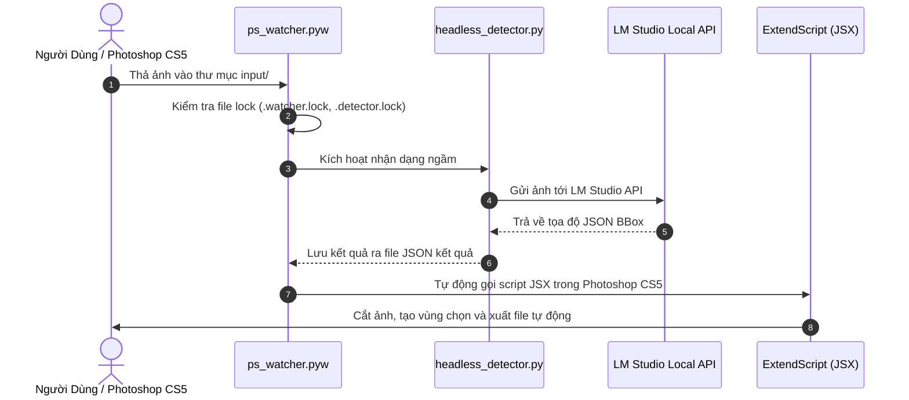

# 🎨 CHI TIẾT LOGIC & THUẬT TOÁN XỬ LÝ PHOTOSHOP CS5 (LOGIC_PHOTOSHOP_CS5.md)

Tài liệu này trình bày toàn bộ kiến trúc, luồng hoạt động và thuật toán tự động hóa xử lý ảnh trong **Adobe Photoshop CS5** thông qua các script ExtendScript (.jsx) và Python Watcher/Headless Detector.

---

## 📌 MỤC LỤC
1. [Tổng Quan Kiến Trúc Tự Động Hóa Photoshop CS5](#1-tổng-quan-kiến-trúc-tự-động-hóa-photoshop-cs5)
2. [Logic ExtendScript JSX (`AI_AutoDetect test.jsx`)](#2-logic-extendscript-jsx-ai_autodetect-testjsx)
3. [Logic Script Xuất Ảnh (`SAVE HINH.jsx`)](#3-logic-script-xuất-ảnh-save-hinhjsx)
4. [Logic Watcher & Headless Detector (`PTS CS5 SCRIPT/`)](#4-logic-watcher--headless-detector-pts-cs5-script)
   - [4.1 Giám sát tiến trình & Thư mục (`ps_watcher.pyw`)](#41-giám-sát-tiến-trình--thư-mục-ps_watcherpyw)
   - [4.2 Bộ nhận dạng ngầm AI (`headless_detector.py`)](#42-bộ-nhận-dạng-ngầm-ai-headless_detectorpy)
   - [4.3 Bộ khởi chạy ngầm (`launcher.pyw` & VBS/BAT)](#43-bộ-khởi-chạy-ngầm-launcherpyw--vbsbat)

---

## 1. TỔNG QUAN KIẾN TRÚC TỰ ĐỘNG HÓA PHOTOSHOP CS5

---

## 2. LOGIC EXTENDSCRIPT JSX (`AI_AutoDetect test.jsx`)

File script `AI_AutoDetect test.jsx` chạy trực tiếp trong môi trường ExtendScript Engine của Adobe Photoshop CS5:

* **Tự động nhận diện Layer & Document hiện tại**:
  * Kiểm tra tài liệu mở trong Photoshop (`app.activeDocument`).
  * Tự động nhân bản Layer (`duplicate`) để giữ nguyên Layer gốc an toàn.

* **Thuật Toán Xác Định Vùng Chọn Trang Sức (Selection Bounds Algorithm)**:
  1. Trích xuất màu nền xung quanh thiết kế (thường là màu trắng hoặc xám nhạt).
  2. Sử dụng thuật toán đếm vùng ảnh có màu (`Color Range / Tolerance Filtering`) để phân biệt đối tượng trang sức chính với vùng nền xung quanh.
  3. Tính toán 4 điểm cực của vật thể: `[X_min, Y_min, X_max, Y_max]`.
  4. Mở rộng lề tự động (Padding 10-15px) xung quanh vật thể để không bị xén sát mép nét vẽ.

* **Tự Động Crop & Căn Giữa (Auto Crop & Centering)**:
  * Thực hiện lệnh `activeDocument.crop(bounds)`.
  * Tự động thay đổi kích thước Canvas (`resizeCanvas`) để đối tượng nằm chính giữa khung hình với tỷ lệ chuẩn.

---

## 3. LOGIC SCRIPT XUẤT ẢNH (`SAVE HINH.jsx`)

File script `SAVE HINH.jsx` đảm nhận việc lưu file tự động theo đúng định dạng và chuẩn đặt tên:

* **Tự Động Đặt Tên File (Auto Naming)**:
  * Đọc tên tài liệu gốc hoặc đọc Metadata trích xuất từ AI (mã sản phẩm, tên góc nhìn `FRONT`, `PERSPECTIVE`, `SIDE`, ...).
  * Loại bỏ các ký tự đặc biệt không hợp lệ trong Windows (`/ \ : * ? " < > |`).

* **Thiết Lập Thông Số Xuất File (Export Settings)**:
  * **PNG-24**: Bảo toàn độ phân giải cao và hỗ trợ Kênh Alpha (Background Trong Suốt) cho góc nhìn `PERSPECTIVE`.
  * **JPEG High Quality**: Thiết lập `quality = 12` cho các góc nhìn 2D kỹ thuật (`FRONT`, `TOP`, `LEFT`, ...).

---

## 4. LOGIC WATCHER & HEADLESS DETECTOR (`PTS CS5 SCRIPT/`)

### 4.1 Giám sát tiến trình & Thư mục (`ps_watcher.pyw`)
* **Chạy ngầm (No GUI Window)**: Đuôi mở rộng `.pyw` cho phép Python chạy ngầm hoàn toàn mà không hiện cửa sổ CMD đen.
* **Quản Lý File Lock (`.watcher.lock`, `.detector.lock`)**:
  * Tránh tình trạng trùng lặp tiến trình hoặc xung đột khi có nhiều ảnh được thả vào cùng lúc.
  * Khi đang xử lý một ảnh, file `.detector.lock` được tạo ra. Xử lý xong sẽ tự động xóa lock.
* **Vòng Lặp Vô Hạn Giám Sát Thư Mục (Folder Polling Loop)**:
  * Quét thư mục `input/` mỗi 1-2 giây.
  * Khi phát hiện định dạng ảnh hỗ trợ (`.png`, `.jpg`, `.jpeg`, `.bmp`, `.psd`), tiến trình sẽ lập tức kích hoạt bộ nhận dạng AI.

### 4.2 Bộ nhận dạng ngầm AI (`headless_detector.py`)
* Chạy độc lập không phụ thuộc vào giao diện Tkinter GUI.
* Tự động tải cấu hình từ `config.py` (Địa chỉ IP LM Studio, Model Name, Retry Count).
* Thực hiện tiền xử lý ảnh (Resize 2048px, encode Base64), gửi tới LM Studio API, nhận JSON BBox và lưu ra file `.json` để script Photoshop CS5 đọc dữ liệu.

### 4.3 Bộ khởi chạy ngầm (`launcher.pyw` & VBS/BAT)
* `start_watcher.vbs`: Khởi chạy file batch mà không làm nháy cửa sổ đen.
* `start_watcher.bat`: File kịch bản khởi chạy môi trường Python virtualenv và tiến trình `ps_watcher.pyw`.
