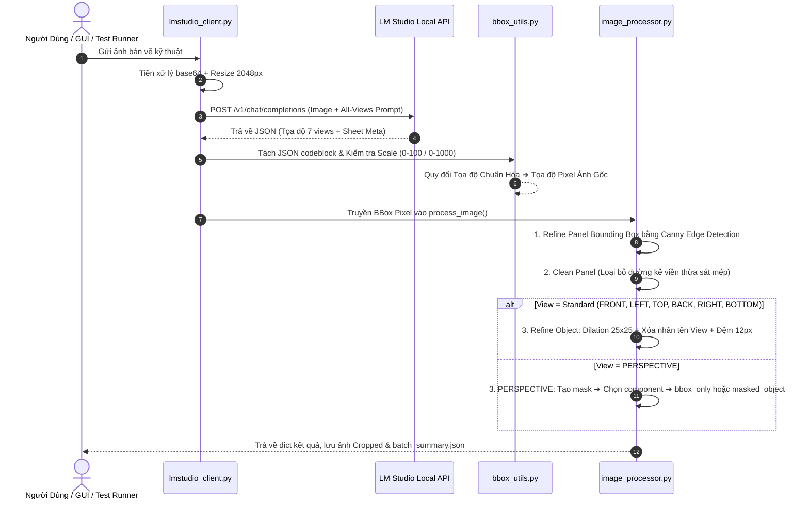
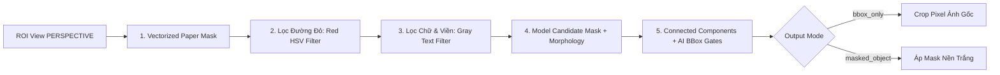

# 🧠 CHI TIẾT LOGIC & THUẬT TOÁN XỬ LÝ PYTHON AI (LOGIC_PYTHON_PROCESSOR.md)

Tài liệu này trình bày chi tiết toàn bộ kiến trúc lập trình, thuật toán xử lý ảnh OpenCV, mô hình Vision AI và luồng logic của hệ thống **Jewelry Front Detector** (Python).

---

## 📌 MỤC LỤC
1. [Luồng Dữ Liệu Tổng Thể (Data Flow Architecture)](#1-luồng-dữ-liệu-tổng-thể)
2. [Logic Module 1: `bbox_utils.py` (Toán Học & Tọa Độ)](#2-logic-module-1-bbox_utilspy-toán-học--tọa-độ)
3. [Logic Module 2: `prompts.py` & `lmstudio_client.py` (Vision AI Engine)](#3-logic-module-2-promptspy--lmstudio_clientpy-vision-ai-engine)
4. [Logic Module 3: `image_processor.py` (Core OpenCV Engine)](#4-logic-module-3-image_processorpy-core-opencv-engine)
   - [4.1 Tinh chỉnh Panel Khung Bảng (`refine_panel_bbox_opencv`)](#41-tinh-chỉnh-panel-khung-bảng-refine_panel_bbox_opencv)
   - [4.2 Tự động cắt viền dư mép Panel (`clean_panel_crop`)](#42-tự-động-cắt-viền-dư-mép-panel-clean_panel_crop)
   - [4.3 Tinh chỉnh Vật Thể Đơn (`refine_object_bbox_opencv`)](#43-tinh-chỉnh-vật-thể-đơn-refine_object_bbox_opencv)
   - [4.4 Thuật Toán Riêng PERSPECTIVE (`refine_perspective_object_opencv`)](#44-thuật-toán-riêng-perspective-refine_perspective_object_opencv)
5. [Logic Module 4: `gui.py` & `result_contract.py` (Đa Luồng & Contract)](#5-logic-module-4-guipy--result_contractpy-đa-luồng--contract)

---

## 1. LUỒNG DỮ LIỆU TỔNG THỂ



---

## 2. LOGIC MODULE 1: `bbox_utils.py` (TOÁN HỌC & TỌA ĐỘ)

Module này đảm nhận toàn bộ các phép toán không gian liên quan đến Bounding Box:

1. **Phát Hiện Hệ Tọa Độ (`detect_coordinate_scale`)**:
   * Một số Vision Model nhỏ trả về tọa độ ở hệ $0-100$ thay vì $0-1000$.
   * Hàm kiểm tra nếu tất cả các giá trị tọa độ $\le 100$, hệ thống tự động nhân hệ số $10.0$ để quy về chuẩn $0-1000$.

2. **Chuyển Đổi Tọa Độ (`normalized_bbox_to_pixel`)**:
   * Công thức toán học chuyển từ chuẩn hóa $0-1000$ sang Pixel thật $(W, H)$:
     $$x_{pixel} = \frac{x_{norm} \times W}{1000}, \quad y_{pixel} = \frac{y_{norm} \times H}{1000}$$

3. **Tính Chỉ Số IoU (`bbox_iou`)**:
   * Dùng để so sánh độ trùng khớp giữa BBox AI dự đoán và BBox OpenCV dò được:
     $$\text{IoU} = \frac{\text{Area}(\text{Box}_{AI} \cap \text{Box}_{CV})}{\text{Area}(\text{Box}_{AI} \cup \text{Box}_{CV})}$$
   * Nếu $\text{IoU} < 0.35$ (`MIN_IOU_THRESHOLD`), hệ thống sẽ hủy bỏ kết quả OpenCV và quay về dùng BBox của AI để tránh lệch khung.

---

## 3. LOGIC MODULE 2: `prompts.py` & `lmstudio_client.py` (VISION AI ENGINE)

* **Prompt Kỹ Thuật Chuyên Biệt**:
  * Ép Vision Model đóng vai *Visual-Grounding Assistant*.
  * Quy tắc ngặt nghèo: **Chỉ trả về JSON thuần**, không giải thích, không kèm đoạn văn ngẫu nhiên.
  * Hướng dẫn trích xuất Metadata góc trên bên phải (`drawing_number`), bảng thông số kim loại (`metal`, `brand`, `metal_weight`) và 7 góc nhìn.

* **Cơ Chế Retry & Parse JSON Kháng Lỗi (`send_image_to_model_all_views`)**:
  * Regex tự động cắt lọc và parse chuỗi JSON từ block ` ```json ... ``` `.
  * Nếu kết quả bị lỗi cú pháp JSON, hàm tự động thử lại (`RETRY_COUNT = 2`) với thời gian chờ 2 giây.

---

## 4. LOGIC MODULE 3: `image_processor.py` (CORE OPENCV ENGINE)

### 4.1 Tinh chỉnh Panel Khung Bảng (`refine_panel_bbox_opencv`)
* **Mục đích:** Dò chuẩn xác viền ô bảng kẻ trên bản vẽ.
* **Các bước thực hiện:**
  1. Mở rộng vùng tìm kiếm BBox AI thêm 8% (`PANEL_SEARCH_EXPAND_RATIO`).
  2. Dùng bộ lọc **GaussianBlur + Canny Edge Detection** để phát hiện nét kẻ.
  3. Dùng **Morphology Kernels** ngang `(40, 1)` và dọc `(1, 40)` trích xuất đường kẻ bảng thẳng.
  4. Lọc contour bằng diện tích tối thiểu `1000 px²`, IoU sơ bộ và `PANEL_PREFILTER_MAX_CENTER_DISTANCE_RATIO = 0.50`.
  5. Candidate cuối chỉ chấp nhận khi IoU $\ge 0.35$ và khoảng cách tâm $\le 0.25$ đường chéo BBox AI.

---

### 4.2 Tự động cắt viền dư mép Panel (`clean_panel_crop`)
* **Mục đích:** Cắt bỏ đường ranh giới ô bảng bị dính sát mép ảnh crop.
* **Cơ chế bảo vệ:**
  * Giới hạn tỷ lệ cắt tối đa **18% chiều rộng/chiều cao**.
  * Kiểm tra tỷ lệ nội dung giữ lại (`content_retained_ratio`). Nếu mất quá $15\%$ nét vẽ ($< 85\%$), tự động khôi phục về ảnh gốc.

---

### 4.3 Tinh chỉnh Vật Thể Đơn (`refine_object_bbox_opencv`)
* **Áp dụng cho:** `FRONT`, `LEFT`, `RIGHT`, `TOP`, `BOTTOM`, `BACK`.
* **Thuật toán chi tiết:**
  1. **Nới lỏng lề tìm kiếm (15%):** Đảm bảo bắt trọn con số đo đạc mép ngoài.
  2. **Dilation Rộng (`kernel 25x25`):** Phép giãn nét giúp gom đường chỉ dẫn kích thước màu đỏ/xanh, số đo trong ô vàng bị đứt đoạn thành một khối thống nhất với vật thể chính.
  3. **Xóa nhãn tên View:** Tự động phát hiện và xóa chữ nhãn tên View ở phần 18% phía trên ô bảng.
  4. **Thêm lề đệm an toàn:** Cộng thêm lề đệm động `pad = max(12, 4% ROI)` xung quanh, giúp con số không bao giờ chạm dính viền ảnh crop.

---

### 4.4 Thuật Toán Riêng PERSPECTIVE (`refine_perspective_object_opencv`)
* **Áp dụng riêng cho:** `PERSPECTIVE`.
* **Chế độ `bbox_only`:** Mask hỗ trợ tìm bbox; ảnh output vẫn là pixel ảnh gốc.
* **Chế độ `masked_object`:** Mask áp lên crop và các pixel nền/artifact thay bằng nền trắng.



1. **Lọc Mép Giấy (`paper_mask`):** Mask bằng NumPy vector hóa.
2. **Lọc Đường Kích Thước Đỏ (`red_mask`):** Chuyển hệ màu HSV, lọc điểm ảnh đỏ:
   $$\text{Hue} \in [0, 15] \cup [165, 180] \quad \text{và} \quad \text{Saturation} > 45$$
3. **Lọc Chữ Nhãn & Đường Bảng (`text_grid_mask`):** Tìm điểm ảnh xám ($S < 32, V \in [30, 225]$). Kiểm tra chữ nhãn (chiều cao $< 32px$) hoặc đường thẳng (dày $\le 5px$) để xóa bỏ.
4. **Nhận Diện Mô Hình 3D (`model_pixels`):**
   * Nhận diện điểm ảnh kim loại/đá quý ($S > 18$) hoặc mảng đổ bóng kim loại ($V < 210$).
   * Morphology open/close và connected components.
   * Chọn component giao với bbox AI và vượt gate IoU, center distance, area ratio.

---

## 5. LOGIC MODULE 4: `gui.py` & `result_contract.py` (ĐA LUỒNG & CONTRACT)

* **Kiến trúc Bất Đồng Bộ (Asynchronous Threading)**:
  * Sử dụng `QThread` và `AnalysisAllViewsWorker` xử lý AI và OpenCV ở luồng phụ (Background Thread).
  * Luồng chính (UI Thread) nhận tín hiệu `Signal(progress)`, `Signal(finished)` để cập nhật `QProgressBar` và xem ảnh preview mà không bị đơ giao diện.

* **Phân loại Kết quả (`result_contract.py`)**:
  * `SUCCESS`: Đủ đúng 7 view duy nhất, validation hợp lệ và 7 crop tồn tại.
  * `PARTIAL`: Còn ít nhất một crop hợp lệ nhưng thiếu/lỗi view.
  * `FAILED`: Không có crop hợp lệ hoặc lỗi nghiêm trọng.
