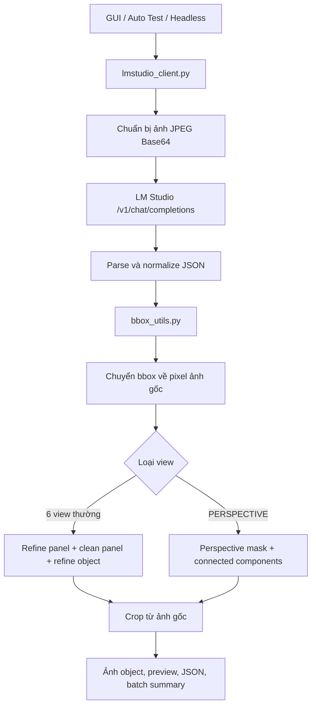

# Jewelry Front Detector — Workflow hiện tại

> Tài liệu hợp nhất và thay thế nội dung tham khảo trong `PROJECT_WORKFLOW.md`,
> `CODE_LOGIC.md` và `DEPENDENCIES.md`.
>
> Trạng thái đối chiếu code: 2026-07-25. Các giá trị trong tài liệu này lấy từ
> code đang chạy, không lấy lại giá trị cũ nếu không còn khớp.

## 1. Mục tiêu hệ thống

Hệ thống nhận một bản vẽ kỹ thuật trang sức, gọi LM Studio Vision một lần để
nhận metadata và bbox của 7 góc nhìn:

`FRONT`, `LEFT`, `TOP`, `BACK`, `RIGHT`, `BOTTOM`, `PERSPECTIVE`.

Sau đó OpenCV refine bbox trên ảnh gốc và tạo crop chứa:

- Toàn bộ vật thể trang sức và đá.
- Số đo, đường dóng và mũi tên kích thước đỏ/xanh/đen.
- Một khoảng trắng an toàn nhỏ để nội dung không chạm mép crop.

## 2. Kiến trúc tổng thể



Nguyên tắc quan trọng:

- AI chỉ cung cấp bbox khởi tạo.
- OpenCV không xử lý trên ảnh đã resize gửi AI; toàn bộ refine và crop dùng ảnh
  gốc.
- Bbox OpenCV chỉ được dùng khi vượt qua validation gate. Nếu không, pipeline
  fallback về bbox AI.
- `PERSPECTIVE` có thuật toán riêng, không dùng chung object refine của 6 view
  thường.

## 3. Các entry point

### 3.1 GUI

- Khởi chạy: `python main.py`.
- `main.py` tạo `QApplication` và `gui.MainWindow`.
- Luồng chính dùng `gui.AnalysisAllViewsWorker`.
- Worker gọi `lmstudio_client.send_image_to_model_all_views()`, sau đó gọi
  `image_processor.process_image()` một lần cho mỗi view.
- AI và OpenCV chạy trong `QThread`; UI nhận trạng thái qua Qt signals.

Thư mục chọn ảnh mặc định của GUI:

`output/AutoTest`

### 3.2 Auto Test / batch

```powershell
python run_auto_test.py
python run_auto_test.py --clean
```

- Đọc ảnh trong `AUTO_TEST_DIR`.
- Gọi cùng LM Studio client và cùng `image_processor.process_image()` như GUI.
- Ghi từng bộ kết quả vào `output/AutoTest_Results/<tên ảnh>/`.
- Ghi tổng hợp vào `output/AutoTest_Results/batch_summary.json`.
- Không xóa kết quả cũ nếu không truyền `--clean`.
- `--clean` chỉ được phép dọn bên trong output root đã xác nhận.

### 3.3 Headless cho Photoshop

File:

`../PTS CS5 SCRIPT/headless_detector.py`

Headless thêm thư mục project vào `sys.path`, rồi import trực tiếp:

- `send_image_to_model_all_views`
- `bbox_utils`
- `image_processor`
- `ENABLE_OPENCV_REFINE`

Do đó headless dùng chung logic AI, normalize bbox và OpenCV với GUI. Các thay
đổi trong `config.py` hoặc `image_processor.py` chỉ có hiệu lực sau khi restart
process headless.

Khác biệt của headless:

- Theo dõi job/ảnh trong `PTS CS5 SCRIPT/input`.
- Có single-instance lock và cơ chế claim file vào `_processing`.
- Tạm thay `image_processor.save_cv2_image` bằng hàm no-op: lấy bbox nhưng không
  lưu bộ crop/preview chuẩn của GUI.
- Xuất JSON riêng cho Photoshop vào `PTS CS5 SCRIPT/output`.
- Có AI lần 2 để đọc kích thước từ Photoshop selection hoặc crop fallback.
- Gọi all-views với `retry_count=0`.
- Dùng URL mặc định của project thay vì URL nhập trên GUI.

Biến `JEWELRY_PROJECT_DIR` có thể đổi project mà headless import. Nếu không đặt,
headless dùng thư mục `jewelry_front_detector` nằm cạnh `PTS CS5 SCRIPT`.

## 4. Luồng xử lý chi tiết

### Bước 1 — Đọc file và chuẩn bị request

File chính: `lmstudio_client.py`

Hàm: `prepare_image_data_url_for_lm()`

1. Mở ảnh bằng Pillow.
2. Áp dụng EXIF transpose nếu có.
3. Chuyển ảnh sang RGB.
4. Nếu cạnh dài vượt `MAX_AI_SIZE = 2048`, resize giữ tỷ lệ bằng LANCZOS.
5. Encode lại thành JPEG với `AI_JPEG_QUALITY = 90`.
6. Mã hóa Base64 thành `data:image/jpeg;base64,...`.

Ảnh có cạnh dài không vượt 2048 không bị thay đổi kích thước hình học, nhưng
vẫn được encode JPEG quality 90. Model Vision trong LM Studio có thể tiếp tục
preprocess nội bộ tùy kiến trúc model.

### Bước 2 — Gọi LM Studio

Hàm chính: `send_image_to_model_all_views()`

Endpoint:

`http://localhost:1234/v1/chat/completions`

Payload gồm:

- System prompt và all-views prompt từ `prompts.py`.
- Ảnh Base64.
- Model đang chọn.
- `temperature = 0.0`.
- `max_tokens = 1500`.

Prompt yêu cầu `object_bbox` bao gồm vật thể, đá, mũi tên, đường dóng và số đo.
OpenCV tiếp tục hiệu chỉnh vì bbox của Vision model có thể rộng, hẹp hoặc lệch.

Mặc định client retry tối đa 2 lần, chờ 2 giây giữa các lần. Headless chủ động
ghi đè thành `retry_count=0`.

### Bước 3 — Parse và kiểm tra JSON

File:

- `lmstudio_client.py`
- `bbox_utils.py`

Các bước:

1. `extract_json_safe()` nhận JSON thuần, JSON trong Markdown code fence hoặc
   JSON nằm trong text.
2. `normalize_all_views_payload()` chuẩn hóa metadata sheet và danh sách view.
3. Kiểm tra đủ tên view, bbox có 4 số, center có 2 số và giá trị hữu hạn.
4. Chuẩn hóa `drawing_number`, `metal`, `brand`, `metal_weight`.
5. Trả lỗi rõ ràng nếu parse hoặc schema không hợp lệ.

### Bước 4 — Chuẩn hóa hệ tọa độ

File: `bbox_utils.py`

Hệ tọa độ chuẩn là `0..1000` trên toàn ảnh.

Nếu model trả hệ `0..100`, `detect_coordinate_scale()` trả multiplier `10` và
caller gọi `rescale_response_coords()` trước khi xử lý.

Đổi sang pixel:

```text
x_pixel = x_normalized × image_width  / 1000
y_pixel = y_normalized × image_height / 1000
```

Sau chuyển đổi, bbox được clamp trong kích thước ảnh gốc và được validate lại.

### Bước 5 — Refine panel cho 6 view thường

Hàm: `refine_panel_bbox_opencv()`

Không chạy cho `PERSPECTIVE`.

1. Mở rộng vùng tìm kiếm panel theo `PANEL_SEARCH_EXPAND_RATIO = 0.08`.
   `expand_pixel_bbox()` chia phần mở rộng đều cho hai phía.
2. Chuyển ROI sang grayscale.
3. Gaussian blur và Canny edge.
4. Morphology kernel ngang `(40, 1)` và dọc `(1, 40)` để nối đường bảng.
5. Tìm contour và lọc theo:
   - Diện tích tối thiểu: `1000 px²`.
   - IoU panel tối thiểu: `0.35`.
   - Center-distance prefilter: `0.50`.
   - Center-distance acceptance: `0.25`.
6. Nếu candidate không đạt, giữ nguyên bbox panel AI.

Chống lẹm ở hàng cuối:

- Nếu bbox panel AI cách đáy ảnh không quá 8% chiều cao,
  `PANEL_BOTTOM_EDGE_SNAP_RATIO = 0.08` mở miền tìm kiếm xuống đáy ảnh.
- Mục tiêu là không để contour panel dừng sớm và cắt vật thể dài sát đáy trang.
- `clean_panel_crop()` vẫn loại lại đường viền bảng nếu có.

### Bước 6 — Clean panel

Hàm: `clean_panel_crop()`

1. Tìm đường bảng đen/xám sát bốn cạnh.
2. Chỉ trim tối đa `18%` mỗi chiều.
3. Tính lượng nội dung thật còn lại sau trim.
4. Chỉ chấp nhận nếu giữ ít nhất `85%` nội dung.
5. Nếu mất quá nhiều nội dung, fallback về panel crop chưa clean.

### Bước 7 — Refine object cho 6 view thường

Hàm: `refine_object_bbox_opencv()`

1. Tạo search rectangle quanh bbox AI với margin `15%` kích thước panel.
2. Adaptive threshold để lấy nội dung nét vẽ.
3. Tạo red annotation mask để đo/debug. Không xóa kích thước đỏ khỏi output.
4. Loại nhãn tên view nằm ở vùng trên/trái của panel.
5. Loại đường bảng đen/xám dài còn sót gần mép.
6. Dilation kernel `25 × 25` để nối vật thể với đường dóng, mũi tên và số đo.
7. Gom các contour hợp lệ có liên hệ với bbox AI; loại contour quá nhỏ hoặc
   noise ở xa.
8. Thêm padding:

```text
pad = max(OBJECT_PADDING_PX, min(panel_width, panel_height) × OBJECT_PADDING_RATIO)
pad = max(10 px, 2%)
```

Padding thực tế nhìn thấy thường khoảng `20–22 px` vì bbox contour đã bao gồm
halo của dilation.

Acceptance gate:

| Điều kiện | Giá trị |
|---|---:|
| Contour area tối thiểu | `50 px²` |
| Area ratio | `0.30 .. 2.50` |
| IoU với bbox AI | `>= 0.30` |
| Center-distance ratio | `<= 0.25` |

Nếu bất kỳ gate nào không đạt, object bbox fallback về bbox AI và
`fallback_reason` ghi nguyên nhân.

### Bước 8 — Thuật toán riêng cho PERSPECTIVE

Hàm: `refine_perspective_object_opencv()`

Khác 6 view thường:

- Không gọi `refine_panel_bbox_opencv()`.
- Không gọi `clean_panel_crop()`.
- Không gọi `refine_object_bbox_opencv()`.
- Search ROI được clamp trong `panel_bbox` của chính `PERSPECTIVE`, tránh lấy số
  đo hoặc vật thể từ panel kế bên.

Thuật toán:

1. Tạo `paper_mask` cho mép trang.
2. Tạo red annotation mask với hai dải Hue hẹp:
   - Hue thấp: `0..8`.
   - Hue cao: `172..180`.
   - Saturation và Value tối thiểu: `45`.
3. Phân biệt annotation đỏ mảnh với mảng vật thể đỏ/hồng lớn để không làm mất
   chi tiết trang sức hai tông màu.
4. Tạo mask chữ/đường bảng xám.
5. Tạo model mask từ pixel có màu hoặc vùng kim loại tối.
6. Morphology open/close với kernel `7`.
7. Connected components và giữ các component liên hệ bbox AI.
8. Gộp các component hợp lệ để không mất một nửa vật thể nhiều màu.
9. Mở bbox tới annotation đỏ nằm trong ROI để giữ kích thước.
10. Thêm padding riêng `PERSPECTIVE_PADDING_PX = 16`.

Gate của `PERSPECTIVE`:

| Điều kiện | Giá trị |
|---|---:|
| Component area tối thiểu | `200 px²` |
| Area ratio | `0.02 .. 2.50` |
| IoU với bbox AI | `>= 0.05` |
| Center-distance ratio | `<= 0.50` |

Chế độ output:

- `bbox_only` mặc định: mask chỉ dùng để tìm bbox; crop vẫn lấy pixel ảnh gốc.
- `masked_object`: áp mask và thay background/artifact bằng màu trắng.

### Bước 9 — Crop và lưu output

Hàm điều phối: `image_processor.process_image()`

Các file có thể được tạo:

- `<stem>_<view>_object.png`
- `.preview/<stem>_<view>_panel.png`
- `.preview/<stem>_<view>_result.jpg`
- `<stem>_<view>_result.json` khi chạy single-view có `save_json=True`
- `<stem>_all_views_result.json` cho luồng all-views

GUI all-views tạo thêm:

- `.preview/<stem>_all_views.jpg`

Preview all-views chỉ vẽ bbox object cuối màu xanh; không vẽ lại bbox AI màu cam
như bbox cuối.

## 5. Contract kết quả và fallback

Refine metadata có các trường chính:

```json
{
  "attempted": true,
  "success": false,
  "method": "opencv",
  "ai_bbox": [],
  "candidate_bbox": null,
  "final_bbox": [],
  "iou_with_ai": 0.0,
  "center_distance_ratio": 0.0,
  "area_ratio": null,
  "thresholds": {},
  "fallback_reason": null
}
```

Quy tắc:

- `candidate_bbox`: kết quả OpenCV trước quyết định acceptance.
- `final_bbox`: bbox thật sự được dùng để crop.
- Khi OpenCV thất bại, `final_bbox` phải là bbox AI.
- Candidate invalid vẫn được giữ trong metadata để debug.
- `output_files` chỉ khai báo path nếu file tương ứng đã lưu thành công.

`result_contract.py` phân loại:

| Trạng thái | Điều kiện |
|---|---|
| `SUCCESS` | Đủ 7 view duy nhất, validation hợp lệ và đủ 7 crop tồn tại |
| `PARTIAL` | Có ít nhất một crop hợp lệ nhưng thiếu hoặc lỗi view |
| `FAILED` | Không có crop hợp lệ hoặc lỗi nghiêm trọng |

Master JSON được thêm đường dẫn tới chính nó trước khi ghi. Batch summary giữ
sheet metadata, số view expected/received/saved, thời gian và trạng thái.

## 6. Các fallback quan trọng

| Tình huống | Hành vi |
|---|---|
| Không kết nối LM Studio | Trả `ConnectionError`; GUI hiển thị lỗi |
| Model chưa load / HTTP 503 | Trả lỗi model/server chưa sẵn sàng |
| JSON không parse được | Retry theo cấu hình; hết retry thì thất bại |
| Thiếu hoặc trùng view | Contract trả `PARTIAL`/`FAILED` |
| Hệ tọa độ `0..100` | Nhân 10 về `0..1000` |
| Panel refine không đạt gate | Dùng panel bbox AI |
| Panel clean làm mất nội dung | Dùng panel crop chưa clean |
| Object refine không đạt gate | Dùng object bbox AI |
| Perspective không tìm thấy component | Dùng object bbox AI |
| Candidate vượt ảnh hoặc đảo tọa độ | Từ chối candidate và ghi warning |
| Lưu ảnh thất bại | Không khai báo file đó là output hợp lệ |
| Headless lỗi ảnh và `move_source=True` | Chuyển ảnh vào `_processing/_failed` |

## 7. Module và trách nhiệm

| File | Trách nhiệm |
|---|---|
| `main.py` | Entry point GUI |
| `gui.py` | UI, QThread workers, preview và lưu all-views result |
| `config.py` | Path, LM Studio, OpenCV thresholds, padding, output |
| `prompts.py` | System prompt, single-view prompt, all-views prompt |
| `lmstudio_client.py` | Encode ảnh, HTTP, retry, parse và normalize AI response |
| `bbox_utils.py` | Validate, rescale, normalized-to-pixel, IoU, clamp |
| `image_processor.py` | Panel refine, clean panel, object refine, perspective, crop |
| `result_contract.py` | Contract `SUCCESS/PARTIAL/FAILED`, master JSON, batch entry |
| `run_auto_test.py` | Batch runner và batch summary |
| `dimension_crop.py` | Tiện ích đọc kích thước standalone; không thuộc GUI/batch chính |
| `logger_utils.py` | Logger dùng chung |
| `../PTS CS5 SCRIPT/headless_detector.py` | Adapter headless dùng chung detector core |
| `../PTS CS5 SCRIPT/ps_watcher.pyw` | Khởi động/giám sát headless từ tray |

## 8. Dependencies

### Package cài bằng pip

Nội dung `requirements.txt`:

```text
opencv-python>=4.8.0
Pillow>=10.0.0
requests>=2.31.0
PySide6>=6.5.0
numpy>=1.24.0
```

Vai trò:

| Package | Vai trò |
|---|---|
| OpenCV | Threshold, Canny, morphology, contours, mask, crop và preview |
| NumPy | Ma trận ảnh, vector mask, connected-component selection |
| Pillow | EXIF transpose, resize/encode ảnh AI, đọc kích thước |
| Requests | Gọi LM Studio `/models` và `/chat/completions` |
| PySide6 | GUI Qt, QThread, signals và image viewer |

Cài đặt:

```powershell
pip install -r requirements.txt
```

### Module chuẩn Python

Các module quan trọng gồm `json`, `base64`, `io`, `re`, `pathlib`, `time`,
`logging`, `argparse`, `shutil`, `traceback`, `os`, `sys` và `typing`.

Headless Windows dùng thêm `msvcrt` để khóa single instance.

## 9. Cấu hình đang áp dụng

| Nhóm | Tham số | Giá trị |
|---|---|---:|
| LM Studio | `MAX_AI_SIZE` | `2048` |
| LM Studio | `AI_JPEG_QUALITY` | `90` |
| LM Studio | `MAX_TOKENS` | `1500` |
| LM Studio | `REQUEST_TIMEOUT` | `120 s` |
| LM Studio | `RETRY_COUNT` | `2` |
| Panel | `PANEL_SEARCH_EXPAND_RATIO` | `0.08` |
| Panel | `PANEL_BOTTOM_EDGE_SNAP_RATIO` | `0.08` |
| Panel | `MIN_IOU_THRESHOLD` | `0.35` |
| Panel clean | `MAX_PANEL_TRIM_RATIO` | `0.18` |
| Panel clean | `CONTENT_RETAINED_MIN_RATIO` | `0.85` |
| Object | `OBJECT_SEARCH_MARGIN_RATIO` | `0.15` |
| Object | `OBJECT_DILATION_KERNEL_SIZE` | `25` |
| Object | `OBJECT_PADDING_PX` | `10` |
| Object | `OBJECT_PADDING_RATIO` | `0.02` |
| Object | `OBJECT_MIN_IOU_THRESHOLD` | `0.30` |
| Object | `OBJECT_MIN_AREA_RATIO` | `0.30` |
| Object | `OBJECT_MAX_AREA_RATIO` | `2.50` |
| Perspective | `PERSPECTIVE_OUTPUT_MODE` | `bbox_only` |
| Perspective | `PERSPECTIVE_PADDING_PX` | `16` |
| Perspective | `PERSPECTIVE_MIN_IOU_THRESHOLD` | `0.05` |

## 10. Kiểm thử và bảo trì

Chạy toàn bộ unit/integration tests:

```powershell
python -m unittest discover -s tests
```

Trạng thái tại thời điểm cập nhật tài liệu:

- `90/90` tests đạt.
- Replay `21/21` view thực tế đạt object refine sau khi tinh chỉnh padding.

Khi sửa bbox/refine, tối thiểu cần kiểm tra:

1. Sáu view thường giữ đủ vật thể và kích thước.
2. `PERSPECTIVE` không lấy nội dung panel kế bên.
3. Vật thể đỏ/hồng không bị red mask xóa.
4. Vật thể sát đáy trang không bị panel bbox cắt.
5. Crop không quá rộng nhưng không có pixel vật thể chạm mép.
6. Fallback metadata và `final_bbox` đúng bbox thực tế được dùng.
7. GUI, batch và headless vẫn gọi chung core logic.

## 11. Ghi chú về ba tài liệu cũ

Ba file cũ vẫn được giữ để tham khảo lịch sử, nhưng có các giá trị đã lỗi thời,
ví dụ padding object `12 px / 4%`, IoU object `0.35` và chưa mô tả bottom-edge
snap. Khi có mâu thuẫn, ưu tiên theo thứ tự:

1. Code và tests hiện tại.
2. `CURRENT_WORKFLOW.md`.
3. Ba tài liệu cũ.
