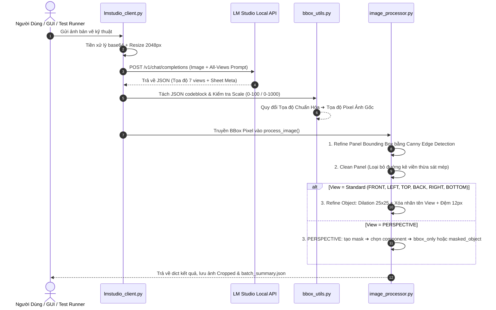
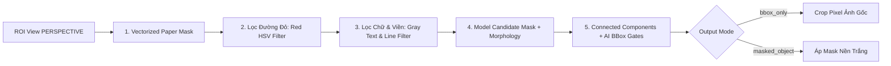

# 🧠 CHI TIẾT LOGIC CODE & THUẬT TOÁN (CODE LOGIC ARCHITECTURE)

Tài liệu này giải thích chi tiết **tư duy lập trình, thuật toán xử lý ảnh và luồng logic** của toàn bộ dự án **Jewelry Front Detector**.

---

## 📌 MỤC LỤC
1. [Luồng Dữ Liệu Tổng Thể (Data Flow Architecture)](#1-luồng-dữ-liệu-tổng-thể)
2. [Logic Module 1: `bbox_utils.py` (Toán Học & Tọa Độ)](#2-logic-module-1-bbox_utilspy-toán-học--tọa-độ)
3. [Logic Module 2: `prompts.py` & `lmstudio_client.py` (Vision AI Engine)](#3-logic-module-2-promptspy--lmstudio_clientpy-vision-ai-engine)
4. [Logic Module 3: `image_processor.py` (Core OpenCV Engine)](#4-logic-module-3-image_processorpy-core-opencv-engine)
   - [4.1 Tinh chỉnh Panel Khung Bảng (`refine_panel_bbox_opencv`)](#41-tinh-chỉnh-panel-khung-bảng-refine_panel_bbox_opencv)
   - [4.2 Tự động cắt viền dư mép Panel (`clean_panel_crop`)](#42-tự-động-cắt-viền-dư-mép-panel-clean_panel_crop)
   - [4.3 Tinh chỉnh Vật Thể Đơn (`refine_object_bbox_opencv`)](#43-tinh-chỉnh-vật-thể-đơn-refine_object_bbox_opencv)
   - [4.4 Thuật Toán Riêng PERSPECTIVE (`refine_perspective_object_opencv`)](#44-thuật-toán-riêng-perspective-refine_perspective_object_opencv)
5. [Logic Module 4: `gui.py` (Đa Luồng & Giao Diện PySide6)](#5-logic-module-4-guipy-đa-luồng--giao-diện-pyside6)

---

## 1. LUỒNG DỮ LIỆU TỔNG THỂ



---

## 2. LOGIC MODULE 1: `bbox_utils.py` (TOÁN HỌC & TỌA ĐỘ)

Module này đảm nhận toàn bộ các phép toán không gian liên quan đến Bounding Box:

1. **Phát Hiện Hệ Tọa Độ (`detect_coordinate_scale`)**:
   * Một số Vision Model nhỏ trả về tọa độ ở hệ $0-100$ thay vì $0-1000$.
   * Hàm kiểm tra nếu tất cả các giá trị tọa độ $\le 100$, hệ thống tự động nhân hệ số $10.0$ để quy về chuẩn $0-1000$.

2. **Chuyển Đổi Tọa Độ (`normalized_bbox_to_pixel`)**:
   * Công thức toán học chuyển từ chuẩn hóa $0-1000$ sang Pixel thật $(W, H)$:
     $$x_{pixel} = \frac{x_{norm} \times W}{1000}, \quad y_{pixel} = \frac{y_{norm} \times H}{1000}$$

3. **Tính Chỉ Số IoU (`bbox_iou`)**:
   * Dùng để so sánh độ trùng khớp giữa BBox AI dự đoán và BBox OpenCV dò được:
     $$\text{IoU} = \frac{\text{Area}(\text{Box}_{AI} \cap \text{Box}_{CV})}{\text{Area}(\text{Box}_{AI} \cup \text{Box}_{CV})}$$
   * Nếu $\text{IoU} < 0.35$ (`MIN_IOU_THRESHOLD`), hệ thống sẽ hủy bỏ kết quả OpenCV và quay về dùng BBox của AI để tránh lệch khung.

---

## 3. LOGIC MODULE 2: `prompts.py` & `lmstudio_client.py` (VISION AI ENGINE)

* **Prompt Kỹ Thuật Chuyên Biệt**:
  * Ép Vision Model đóng vai *Visual-Grounding Assistant*.
  * Đặt quy tắc ngặt nghèo: **Chỉ trả về JSON thuần**, không giải thích, không kèm đoạn văn ngẫu nhiên.
  * Hướng dẫn chi tiết cách trích xuất Metadata góc trên bên phải (`drawing_number`), bảng thông số kim loại (`metal`, `brand`, `metal_weight`) và 7 góc nhìn.

* **Cơ Chế Retry & Parse JSON Kháng Lỗi (`send_image_to_model_all_views`)**:
  * Khi AI trả về kết quả có bao bọc bởi markdown ` ```json ... ``` `, regex sẽ tự động cắt lọc và parse chuỗi JSON.
  * Nếu kết quả bị lỗi cú pháp JSON, hàm tự động thử lại (`RETRY_COUNT = 2`) với thời gian chờ 2 giây.

---

## 4. LOGIC MODULE 3: `image_processor.py` (CORE OPENCV ENGINE)

Đây là trái tim xử lý hình ảnh của dự án với 4 thuật toán chính:

### 4.1 Tinh chỉnh Panel Khung Bảng (`refine_panel_bbox_opencv`)
* **Mục đích:** Dò chuẩn xác viền ô bảng kẻ trên bản vẽ.
* **Các bước thực hiện:**
  1. Mở rộng vùng tìm kiếm BBox AI thêm 8% (`PANEL_SEARCH_EXPAND_RATIO`).
  2. Dùng bộ lọc **GaussianBlur + Canny Edge Detection** để phát hiện các nét kẻ.
  3. Dùng **Morphology Kernels** ngang `(40, 1)` và dọc `(1, 40)` để trích xuất các đường kẻ bảng thẳng.
  4. Pre-filter contour bằng diện tích tối thiểu `1000 px²`, IoU sơ bộ và
     `PANEL_PREFILTER_MAX_CENTER_DISTANCE_RATIO = 0.50`.
  5. Candidate cuối chỉ được chấp nhận khi IoU $\ge 0.35$ và khoảng cách tâm
     không vượt `0.25` đường chéo BBox AI. Nếu không đạt, pipeline giữ bbox AI
     và ghi nguyên nhân trong `fallback_reason`.

---

### 4.2 Tự động cắt viền dư mép Panel (`clean_panel_crop`)
* **Mục đích:** Cắt bỏ các đường ranh giới ô bảng bị dính sát mép ảnh crop.
* **Cơ chế bảo vệ:**
  * Giới hạn tỷ lệ cắt tối đa **18% chiều rộng/chiều cao**.
  * Kiểm tra tỷ lệ nội dung được giữ lại (`content_retained_ratio`). Nếu bị mất quá $15\%$ nét vẽ ($< 85\%$), hàm sẽ tự động **khôi phục về ảnh gốc** để đảm bảo không mất chi tiết.

---

### 4.3 Tinh chỉnh Vật Thể Đơn (`refine_object_bbox_opencv`)
* **Áp dụng cho:** `FRONT`, `LEFT`, `RIGHT`, `TOP`, `BOTTOM`, `BACK`.
* **Thuật toán chi tiết:**
  1. **Nới lỏng lề tìm kiếm ($15\%$):** Đảm bảo bắt trọn các con số đo đạc nằm ở mép ngoài.
  2. **Dilation Rộng (`kernel 25x25`):** Phép giãn nét giúp gom trọn các đường chỉ dẫn kích thước màu đỏ/xanh, số đo trong ô vàng bị đứt đoạn thành một khối thống nhất với vật thể chính.
  3. **Xóa nhãn tên View:** Tự động phát hiện và xóa chữ nhãn tên View ở phần $18\%$ phía trên của ô bảng.
  4. **Thêm lề đệm an toàn:** Cộng thêm lề đệm động `pad = max(12, 4% ROI)` xung quanh, giúp con số và mũi tên không bao giờ chạm dính viền ảnh crop.
  5. **Lọc contour nhiễu:** Bỏ contour nhỏ hơn `50 px²`; contour chỉ nằm trong
     margin phải đủ gần tâm bbox AI, tránh label/noise ở xa kéo phình bbox.
  6. **Acceptance gate cuối:** Candidate phải hợp lệ trong ảnh/panel, có area
     ratio trong `[0.30, 2.50]`, IoU $\ge 0.35$ và center-distance ratio
     $\le 0.25`. Candidate không đạt sẽ fallback bbox AI.

#### Contract metadata và validation Phase 3

Panel và object refine cùng trả các trường:

```json
{
  "attempted": true,
  "success": false,
  "method": "opencv",
  "ai_bbox": [],
  "candidate_bbox": null,
  "final_bbox": [],
  "iou_with_ai": 0.0,
  "center_distance_ratio": 0.0,
  "area_ratio": null,
  "thresholds": {},
  "fallback_reason": null
}
```

`final_bbox` luôn theo bbox pipeline thực sự dùng. Candidate bị post-validation
từ chối vẫn được giữ trong `candidate_bbox`, bbox AI được đưa vào `final_bbox`
và warning được thêm vào kết quả validation. `output_files` chỉ chứa đường dẫn
khác `null` khi ảnh tương ứng được ghi thành công.

GUI và batch dùng `result_contract.py` để phân loại:

- `SUCCESS`: đủ đúng 7 view duy nhất, validation hợp lệ và 7 crop tồn tại.
- `PARTIAL`: còn ít nhất một crop hợp lệ nhưng thiếu/lỗi view.
- `FAILED`: không có crop hợp lệ hoặc lỗi nghiêm trọng.

Master JSON chứa path JSON của chính nó trước khi được ghi xuống đĩa. GUI chỉ
hiển thị thông báo đủ 7 view khi contract trả `SUCCESS`.

---

### 4.4 Thuật Toán Riêng PERSPECTIVE (`refine_perspective_object_opencv`)
* **Áp dụng riêng cho:** `PERSPECTIVE`.
* **Chế độ mặc định `bbox_only`:** Mask chỉ hỗ trợ tìm bbox; ảnh output vẫn là pixel ảnh gốc.
* **Chế độ `masked_object`:** Mask được áp lên crop và các pixel nền/artifact bị thay bằng nền trắng.
* Không gọi output `bbox_only` là ảnh đã tách nền.



1. **Lọc Mép Giấy (`paper_mask`):** Tạo mask bằng phép toán NumPy vector hóa, không lặp Python theo từng pixel.
2. **Lọc Đường Kích Thước Đỏ (`red_mask`):** Chuyển sang hệ màu HSV, lọc bỏ các điểm ảnh màu đỏ:
   $$\text{Hue} \in [0, 15] \cup [165, 180] \quad \text{và} \quad \text{Saturation} > 45$$
3. **Lọc Chữ Nhãn & Đường Bảng (`text_grid_mask`):** Tìm các cụm điểm ảnh đơn sắc xám ($S < 32, V \in [30, 225]$). Kiểm tra nếu có dạng chữ nhãn (chiều cao $< 32px$) hoặc dạng nét thẳng (dày $\le 5px$), lập tức xóa bỏ.
4. **Nhận Diện Mô Hình 3D (`model_pixels`):**
   * Nhận diện các điểm ảnh kim loại/đá quý có màu sắc ($S > 18$) hoặc có mảng đổ bóng kim loại ($V < 210$).
   * Dùng morphology open/close và connected components.
   * Chỉ chọn một component có giao với bbox AI và vượt gate IoU, center distance, area ratio.
   * Metadata trả `mode`, `bbox`, `mask_available`, `mask_applied`, số component và số pixel artifact bị loại.

---

## 5. LOGIC MODULE 4: `gui.py` (ĐA LUỒNG & GIAO DIỆN PYSIDE6)

* **Kiến trúc Bất Đồng Bộ (Asynchronous Threading)**:
  * Sử dụng `QThread` và `AnalysisAllViewsWorker` để thực hiện việc gửi request AI và xử lý OpenCV ở luồng phụ (Background Thread).
  * Luồng chính (UI Thread) lắng nghe qua các tín hiệu `Signal(progress)`, `Signal(finished)`, `Signal(error)` để cập nhật thanh tiến trình (`QProgressBar`) và hiển thị ảnh preview mà **không bao giờ bị đóng băng hay đơ giao diện**.

* **Tự Động Scale & Tương Thích High-DPI**:
  * Tự động điều chỉnh kích thước hiển thị ảnh `ImageViewer` vừa vặn với kích thước cửa sổ mà không làm biến dạng tỷ lệ gốc của bản vẽ.

---
*Tài liệu Logic Code được tổng hợp tự động cho Hệ Thống Jewelry Detector.*
