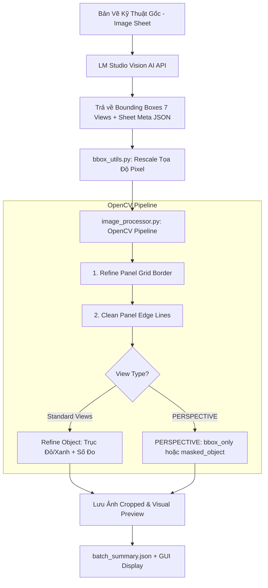

# 📐 ARCHITECTURE & WORKFLOW DOCUMENTATION: JEWELRY FRONT DETECTOR

> **Dự án:** Nhận dạng, tách khung và crop 7 views góc nhìn trang sức từ bản vẽ kỹ thuật bằng LM Studio Vision AI & OpenCV.

---

## 📌 MỤC LỤC
1. [Tổng Quan Kiến Trúc (Architecture Overview)](#1-tổng-quan-kiến-trúc)
2. [Cấu Trúc Thư Mục & Các Module Chính](#2-cấu-trúc-thư-mục--các-module-chính)
3. [Quy Trình Xử Lý Chi Tiết (Detailed Workflow)](#3-quy-trình-xử-lý-chi-tiết)
   - [Phần 1: Khởi Tạo & Đọc Cấu Hình](#phần-1-khởi-tạo--đọc-cấu-hình)
   - [Phần 2: Tiền Xử Lý Ảnh & Gửi Request tới Vision AI](#phần-2-tiền-xử-lý-ảnh--gửi-request-tới-vision-ai)
   - [Phần 3: Parse Kết Quả JSON & Chuẩn Hóa Tọa Độ](#phần-3-parse-kết-quả-json--chuẩn-hóa-tọa-độ)
   - [Phần 4: Thuật Toán Refine Khung Bảng (Panel Clean Crop)](#phần-4-thuật-toán-refine-khung-bảng-panel-clean-crop)
   - [Phần 5: Thuật Toán Refine Vật Thể Đơn (Object Refine)](#phần-5-thuật-toán-refine-vật-thể-đơn-object-refine)
   - [Phần 6: Thuật Toán Riêng Cho PERSPECTIVE](#phần-6-thuật-toán-riêng-cho-perspective)
   - [Phần 7: Xuất Ảnh & Lưu Báo Cáo Batch Summary](#phần-7-xuất-ảnh--lưu-báo-cáo-batch-summary)
4. [Tối Ưu Chi Phí Token (Token Optimization)](#4-tối-ưu-chi-phí-token)
5. [Hướng Dẫn Bảo Trì & Sửa Lỗi Thường Gặp](#5-hướng-dẫn-bảo-trì--sửa-lỗi-thường-gặp)

---

## 1. TỔNG QUAN KIẾN TRÚC



---

## 2. CẤU TRÚC THƯ MỤC & CÁC MODULE CHÍNH

| File / Thư mục | Vai Trò & Chức Năng |
| :--- | :--- |
| **`config.py`** | Chứa toàn bộ cấu hình toàn cục: URL LM Studio, `MAX_AI_SIZE`, tỷ lệ lề `margin`, tham số `pad`, màu sắc BBox... |
| **`prompts.py`** | Định nghĩa System Prompt và User Prompt hướng dẫn Vision Model nhận dạng metadata và 7 views. |
| **`lmstudio_client.py`** | Gửi ảnh base64 đến LM Studio API local, retry khi gặp lỗi, parse JSON từ Markdown codeblocks. |
| **`bbox_utils.py`** | Các hàm toán học xử lý Bounding Box: chuyển chuẩn hóa (0-1000) ➔ Pixel, tính IoU, clamp mép ảnh, phát hiện hệ tọa độ 0-100. |
| **`image_processor.py`** | **Core Engine**: Tinh chỉnh khung bảng, cắt vật thể, xử lý PERSPECTIVE theo `bbox_only`/`masked_object` và vẽ preview. |
| **`gui.py`** | Giao diện người dùng PySide6 hỗ trợ xem preview 7 views, đa luồng QThread, tùy chỉnh tham số. |
| **`run_auto_test.py`** | Batch runner tạo summary `SUCCESS/PARTIAL/FAILED`; chỉ dọn kết quả cũ khi truyền `--clean`. |
| **`result_contract.py`** | Contract dùng chung cho GUI và batch: kiểm tra đủ 7 view, file crop và master JSON. |
| **`main.py`** | Script CLI đơn giản để khởi chạy từ dòng lệnh. |

---

## 3. QUY TRÌNH XỬ LÝ CHI TIẾT

### PHẦN 1: KHỞI TẠO & ĐỌC CẤU HÌNH
* **File liên quan:** `config.py`
* **Nhiệm vụ:** 
  * Cấu hình URL endpoint `http://localhost:1234/v1`.
  * Đặt kích thước tối đa cho AI `MAX_AI_SIZE = 1536` hoặc `2048` để cân bằng giữa độ phân giải số đo và số lượng Token tiêu thụ.

---

### PHẦN 2: TIỀN XỬ LÝ ẢNH & GỬI REQUEST TỚI VISION AI
* **File liên quan:** `lmstudio_client.py`, `prompts.py`
* **Nhiệm vụ:**
  1. Encode ảnh sang dạng base64 JPEG (`AI_JPEG_QUALITY = 90`).
  2. Gửi request tới LM Studio bằng prompt `get_all_views_user_prompt()`.
  3. AI sẽ trả về thông tin metadata bản vẽ (`drawing_number`, `metal`, `brand`, `metal_weight`) và danh sách 7 góc nhìn (`FRONT`, `LEFT`, `RIGHT`, `TOP`, `BOTTOM`, `BACK`, `PERSPECTIVE`).

---

### PHẦN 3: PARSE KẾT QUẢ JSON & CHUẨN HÓA TỌA ĐỘ
* **File liên quan:** `bbox_utils.py`
* **Nhiệm vụ:**
  1. Tách chuỗi phản hồi từ AI (nếu có markdown ` ```json `).
  2. Hàm `detect_coordinate_scale()` kiểm tra xem AI trả tọa độ hệ 0–100 hay 0–1000.
  3. Chuyển đổi tọa độ từ 0–1000 sang Pixel thực tế dựa theo `(width, height)` của ảnh gốc.

---

### PHẦN 4: THUẬT TOÁN REFINE KHUNG BẢNG (PANEL CLEAN CROP)
* **File liên quan:** `image_processor.py` -> `refine_panel_bbox_opencv()`, `clean_panel_crop()`
* **Nhiệm vụ:**
  1. Mở rộng BBox từ AI thêm `8%` (`PANEL_SEARCH_EXPAND_RATIO`).
  2. Tìm các đường kẻ khung bảng đen/xám sát mép bằng Canny & Morphological.
  3. Loại bỏ các đường kẻ viền dư thừa sát mép panel bằng `clean_panel_crop()`, bảo vệ không cắt lẹm nội dung bên trong (`content_retained >= 85%`).

---

### PHẦN 5: THUẬT TOÁN REFINE VẬT THỂ ĐƠN (OBJECT REFINE)
* **File liên quan:** `image_processor.py` -> `refine_object_bbox_opencv()`
* **Áp dụng cho:** các view tiêu chuẩn (`FRONT`, `LEFT`, `RIGHT`, `TOP`, `BOTTOM`, `BACK`).
* **Nhiệm vụ:**
  1. Nới rộng lề tìm kiếm `margin = 15%` xung quanh BBox AI dự đoán.
  2. Dùng Kernel Dilation `(25, 25)` để kết nối trọn vẹn các mũi tên chỉ kích thước (đỏ/xanh), ô con số đo đạc với vật thể chính.
  3. Xóa nhãn tên view (`FRONT`, `LEFT`...) ở phần dải trên của panel.
  4. Thêm lề đệm động `pad = max(12, 4% ROI)` để các đầu mũi tên không bị chạm sát viền crop.
  5. Lọc contour nhỏ hơn `50 px²` và contour nhiễu ở xa không liên hệ với bbox
     AI gốc.
  6. Chỉ nhận bbox OpenCV khi candidate hợp lệ, area ratio nằm trong
     `[0.30, 2.50]`, IoU tối thiểu `0.35`, và center-distance ratio tối đa
     `0.25`; nếu không đạt thì dùng bbox AI.

Panel refine có pre-filter center-distance `0.50` và acceptance cuối `0.25`.
Mọi nhánh success/fallback trả metadata gồm `candidate_bbox`, `final_bbox`,
giá trị đo, `thresholds` và `fallback_reason`. `final_bbox` phải trùng bbox
thực tế được dùng để crop.

---

### PHẦN 6: THUẬT TOÁN RIÊNG CHO PERSPECTIVE
* **File liên quan:** `image_processor.py` -> `refine_perspective_object_opencv()`
* **Áp dụng riêng cho:** view `PERSPECTIVE`.
* **Nhiệm vụ:**
  1. **Lọc mép trang giấy (`paper_mask`):** Tạo mask bằng NumPy vector hóa nếu ROI nằm gần sát 25px mép ảnh gốc.
  2. **Lọc đường kích thước màu đỏ (`red_mask`):** Lọc theo dải HSV màu đỏ $(H \in [0, 15] \cup [165, 180], S > 45)$.
  3. **Lọc chữ & đường kẻ bảng (`text_grid_mask`):** Phát hiện các cụm chữ đen/xám nhãn `PERSPECTIVE` hoặc đường kẻ bảng xung quanh.
  4. **Nhận diện mô hình 3D (`model_pixels`):** Nhận diện điểm ảnh kim loại/đá quý có màu sắc $(S > 18)$ hoặc có độ bóng đổ kim loại $(V < 210)$.
  5. Dùng connected components và chỉ chọn component liên hệ với bbox AI theo IoU, center distance và area ratio.
  6. `bbox_only` (mặc định) chỉ crop vùng ảnh gốc; không được mô tả là tách nền.
  7. `masked_object` áp mask và thay nền/chữ/đường đỏ bằng nền trắng.

---

### PHẦN 7: XUẤT ẢNH & LƯU BÁO CÁO BATCH SUMMARY
* **File liên quan:** `image_processor.py`, `run_auto_test.py`
* **Nhiệm vụ:**
  1. Lưu các ảnh crop góc nhìn vào `output/AutoTest_Results/{Tên_Ảnh}/`.
  2. Lưu ảnh xem trước có vẽ Bounding Box màu vào `output/.preview/`.
  3. Tổng hợp toàn bộ dữ liệu tọa độ, kích thước ảnh crop, thời gian xử lý và metadata vào file `output/AutoTest_Results/batch_summary.json`.
  4. Chỉ ghi đường dẫn vào `output_files` khi thao tác lưu tương ứng thành công;
     output không được tạo có giá trị `null`. Candidate refine invalid fallback
     về bbox AI và được ghi vào validation warnings.
  5. GUI all-views nhận một object gồm `status`, `sheet`, `views`,
     `validation`, `raw_response` và `output_files`; không báo đủ 7 view nếu
     thiếu crop hoặc validation thất bại.
  6. Batch summary giữ sheet metadata, số view expected/received/saved và
     trạng thái `SUCCESS`, `PARTIAL` hoặc `FAILED`.
  7. Master JSON được ghi sau khi thêm path JSON của chính nó; mọi path khai
     báo phải tồn tại và có kích thước lớn hơn 0.

---

## 4. CẤU HÌNH ĐỘ PHÂN GIẢI & CHI PHÍ TOKEN

| Thông Số | Giá Trị | Lý Do Cấu Hình |
| :--- | :--- | :--- |
| **`MAX_AI_SIZE`** | **`2048` px** | 🎯 **Giữ độ phân giải gốc cao nhất** để AI nhận diện chính xác 100% các số đo nhỏ & 7 góc nhìn, tránh nhận diện nhầm. |
| **`MAX_TOKENS`** | **`1500` tokens** | Giới hạn độ dài phản hồi JSON của Vision AI vừa đủ cho 7 góc nhìn + Sheet metadata. |
| **`AI_JPEG_QUALITY`** | **`90`** | Đảm bảo chất lượng nén ảnh cao không làm mờ nét vẽ kỹ thuật mảnh. |

---

## 5. HƯỚNG DẪN BẢO TRÌ & SỬA LỖI THƯỜNG GẶP

### ❓ Vấn đề 1: Muốn thay đổi độ rộng lề đệm của ảnh Crop
👉 Sửa tại `image_processor.py`:
* Đối với view thường: Chỉnh `pad = max(12, int(min(pw, ph) * 0.04))` ở dòng ~440.
* Đối với PERSPECTIVE: Chỉnh `PERSPECTIVE_PADDING_PX` trong `config.py`.

### ❓ Vấn đề 2: Muốn chạy lại toàn bộ Test để kiểm tra chất lượng
👉 Mở Terminal tại thư mục dự án và chạy:
```bash
python run_auto_test.py
```
Mặc định script giữ kết quả cũ. Muốn dọn đúng thư mục
`output/AutoTest_Results` trước khi chạy:

```bash
python run_auto_test.py --clean
```

Thao tác clean từ chối target nằm ngoài output root đã xác nhận.

`dimension_crop.py` hiện là tiện ích standalone cho bước đọc kích thước; không
nằm trong pipeline GUI/batch chính.

---
*Tài liệu được tạo tự động bởi Hệ Thống Jewelry Detector.*
